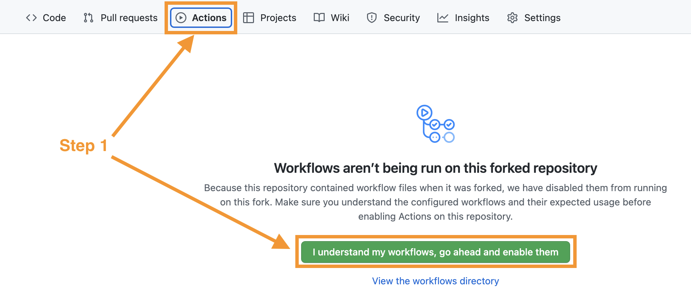
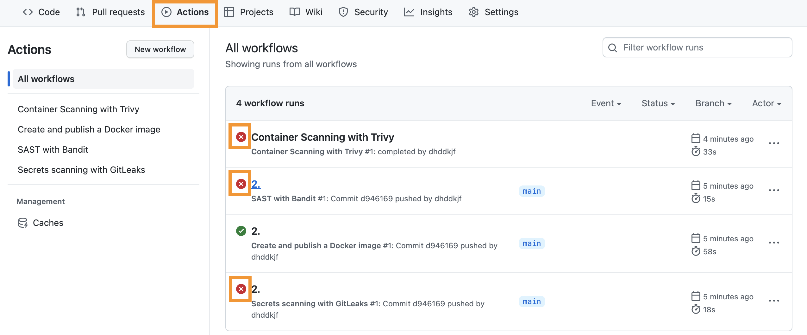
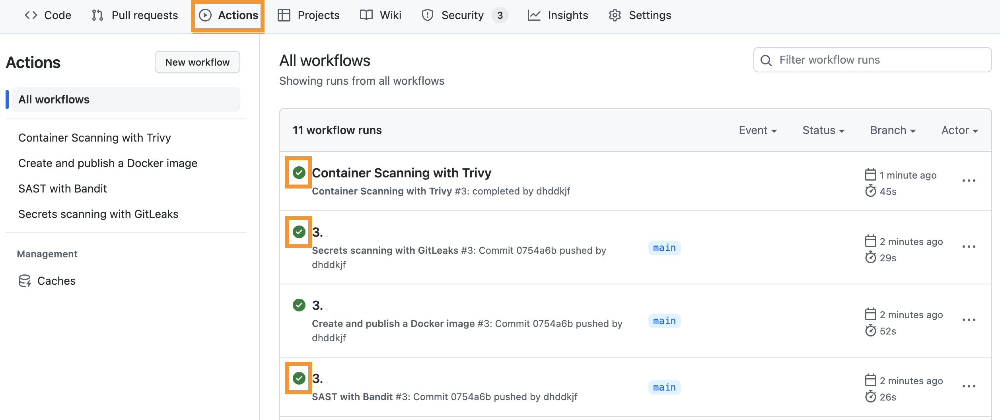
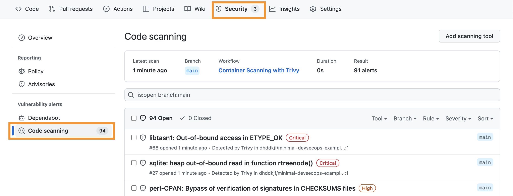
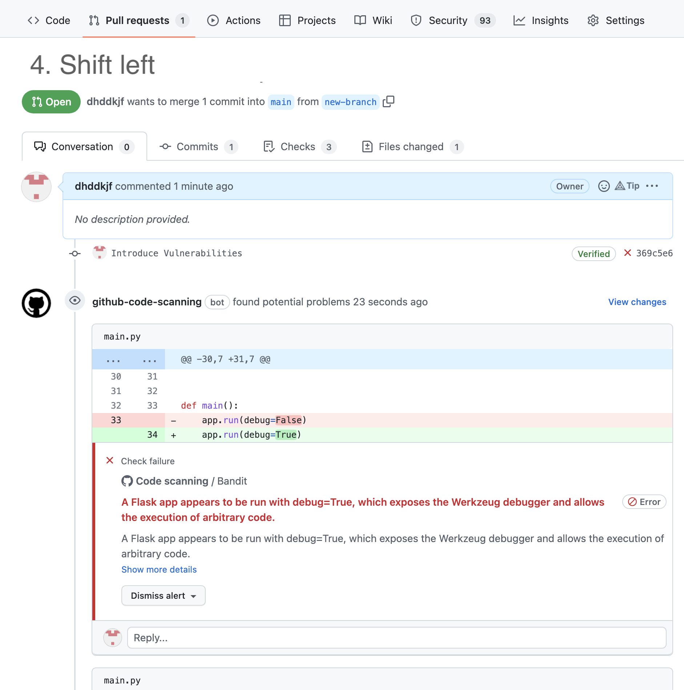

# Module 3: DevSecOps Example
This project is a basic example on how integrate security can be integrated into development workflows.

## Scenario
You are a DevOps Engineer. Until now, the team you are currently working with has not implemented any security activities in their project.  
As your project becomes more mature, the project manager decides it is time to step up the game and start securing the project.   
So now it's your job to introduce security activities into the project. You start with the following two DevOps phases: **Build** and **Code**

## 1. Exercise Setup
To get started perform the following:

0. Fork this project into your own namespace (don't make it private!)
1. Go to the `Actions` section and enable the Workflows (Continuous Integration/Deployment Pipelines)

(General hint: You can start up an online VSCode IDE in GitHub be simply pressing `.` when you are navigating the repository. Might come in handy later.)

## 2. Implement a CI/CD Pipeline with security activities

Okay, now you have the project ready, so lets get our fingers dirty.  
Following the Definition of Done for continuous security integration from the lecture, you first **define your security use cases**. For our purposes, we start with
- Analysis of security vulnerabilities in 3rd party components
- Static application security testing
- Secrets scanning

Following, we **select the pipeline stages**. In our case, on every integration to the defaut branch (here: main branch).

For **the tool selection**, we'll directly implement the following:
- Analysis of security vulnerabilities in 3rd party components: [Trivy](https://github.com/aquasecurity/trivy)
- Static application security testing: [Bandit](https://github.com/PyCQA/bandit)
- Secrets scanning: [GitLeaks](https://github.com/zricethezav/gitleaks)

Now, lets go on to step three and actually integrate the tools. Steps to perform:  

0. Navigate to each of the CI files [.github/workflows/sast.yml](.github/workflows/sast.yml), [.github/workflows/secrets.yml](.github/workflows/secrets.yml), [.github/workflows/trivy_scanning.yml](.github/workflows/trivy_scanning.yml)
1. Uncomment version 1. Commit your changes
2. Check out the `Actions` tab, you will find for each workflow a run that failed. Have a look at the reason why they failed.

## 3. Implement Security Feedback-loop

### 3.1 Improve visualisation of findings

So you have the security activities implemented and you see the respective artifacts in the logs.  
While this is already awesome, your team is not satisfied with this solution, the feedback loop is not implemented sufficiently. Understandably, they don't want to always check the workflow-run-logs to get an overview of the current security state in their project.  

Thus we somehow have to improve the feedback loop implementation for our security findings to proceed with step 4 in our definition of done for continuous security automation. For that purpose follow the next steps:

0. Navigate to each of the CI files [sast.yml](.github/workflows/sast.yml), [secrets.yml](.github/workflows/secrets.yml), [trivy_scanning.yml](.github/workflows/trivy_scanning.yml)
1. Comment out version 1 and uncomment version 2. Commit your changes
2. Check out the `Actions` tab. Magically your workflows now don't fail anymore. And also the findings are no longer displayed in the logs.
3. So where are the findings now? Checkout the `Security` tag. Under `Code Scanning` you will find a large list of findings.
4. Check which security activity produced the most findings? Hint: You can filter the findings like so: `is:open branch:main tool:<ToolName>`

### 3.2 Solve findings
Under normal circumstances it is not your responsibility to fix security issues. However your are short on staff, so you were asked to do that, also to prove that you correctly implemented step 4 of the definition of done.  

0. GitLeaks: Remove the secrets from the file
1. Bandit: Follow the details in the findings descriptions
2. Trivy: Change the base image in `Dockerfile` from `python:3.10` to `python:3.10-slim`

Commit and check `Security > Code Scanning` for findings. Where you able to solve all issues the way described here?

### 4. Shift-left security activities
Your team really appreciates your hard work to help them secure the project.  
Now that they have a good overview of the current security state they want to become a bit more proactive and shift the security activities more left. Which means directly fixing security findings before they are even introduced to the default branch of the project.  

So we iterate over the DoD again, this time a bit faster. The security use cases stay the same:
- Analysis of security vulnerabilities in 3rd party components
- Static application security testing
- Secrets scanning

Shifting security activities more left means to implement the activities, so that they are running on every pull request, which defines our pipeline stages.

We employ the same tools as before.

Implement the following steps to perform step 3 and 4 of the DoD.

0. Navigate to each of the CI files [sast.yml](.github/workflows/sast.yml), [secrets.yml](.github/workflows/secrets.yml)
1. Uncomment version 3. Commit your changes
2. Create a new branch
3. Introduce vulnerabilities in the branch to validate that the pipeline works. For this purpose, re-introduce the vulnerabilities that you solved before. Commit them to the new branch
5. Start a pull request in which you merge the new branch into the main branch
6. In the pull request check the results presented by the `github-code-scanning` bot
7. Verify which activities were performed for the pull request

Note: Remember to fill up the Checklist in the grading workbook
